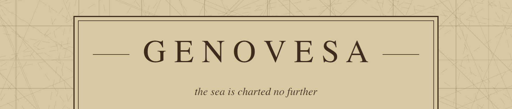

An experiment in procedural 3D terrain, Rust, [Bevy](https://bevy.org) and [Avian](https://github.com/avianphysics/avian).
Where it goes is undecided. Like the wind.


*Sixteen islands, from single-chunk islets 128 m across to 1.5 km continents,
all drawn to one scale.*

## Running

```bash
cargo run
```

The first build compiles all of Bevy and takes several minutes. The same
client runs on macOS, Windows and Linux.

## The world

A seed is a whole world: an infinite plane of ocean with islands scattered
over it, each a height field of layered Perlin noise, generated as it is
approached rather than up front. The look is flat-shaded ground in a small
fixed palette, with no textures and no gradients anywhere. Everything drawn
that is not ground — palms, boats — is a hand-built model, all of them
shown in [`docs/models.md`](docs/models.md).

Every world is served, including a solitary one — the game hosts a server and
joins it over the loopback, so there is one kind of session rather than two.

- `world` — the generator, and the only crate that knows what a seed means.
- `protocol` — the wire between the two ends.
- `server` — holds the world, hands out chunks, and settles anything two
  clients would otherwise disagree about.
- `game` — the Bevy client. Generates nothing: asks for chunks and draws the
  answers.

## The chart

Pressing M lays a chart over the world, carrying only the coast the player has
actually closed with. An island whose shore has been run right around can be
claimed and named, and a claim leaves a cairn on the headland for whoever
walks up that coast next.


*One sheet carrying an island surveyed and lettered, a cairn visited and so
named, and a cairn only ever seen from a distance.*

Working on it: [CLAUDE.md](CLAUDE.md).
