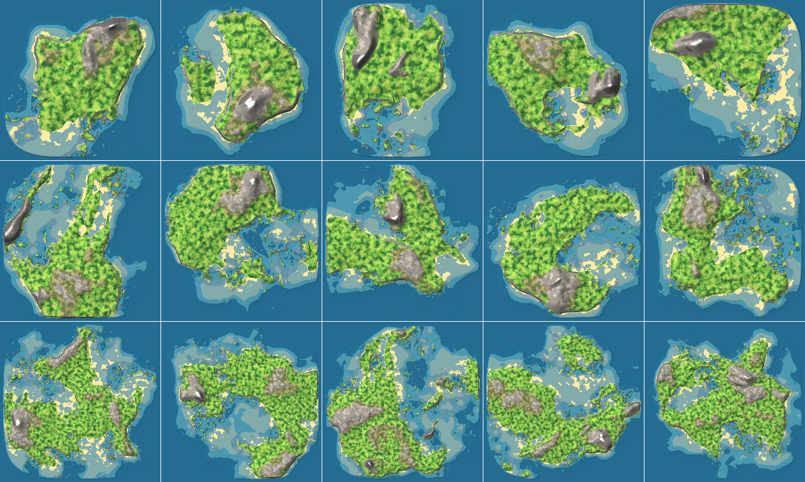
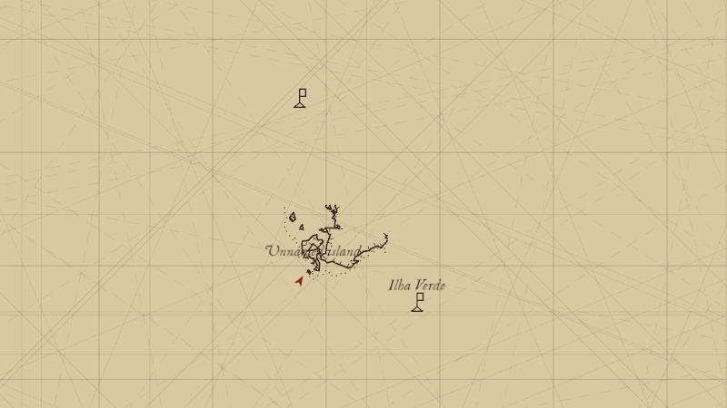

# Genovesa

An experiment in procedural 3D terrain, built with [Bevy](https://bevy.org):
an endless ocean scattered with generated islands, sailed between in a boat.
Where it goes is undecided — it is not a game, and may never be one.



*Sixteen islands, from single-chunk islets 128 m across to 1.5 km continents,
all drawn to one scale. Redrawn by `tools/readme-collage.sh`.*

## Running

```bash
cargo run
```

The first build compiles all of Bevy and takes several minutes. Afterwards
`cargo run --features dev` is quicker, and watches `assets/` so a model
re-exported while the game is running is picked up without a restart.

The same client builds and runs on macOS, Windows and Linux; there is no web
build, and none planned. `tools/macos-app.sh` wraps the macOS one as
`target/Genovesa.app` — its signature is ad-hoc, which opens it on the machine
that built it and nowhere else.

## How it fits together

A seed is a whole world: an infinite plane of ocean with islands scattered
over it, each a height field of layered Perlin noise, generated as it is
approached rather than up front. The look is flat-shaded ground in a small
fixed palette, with no textures and no gradients anywhere.

Every world is served, including a solitary one — the game hosts a server and
joins it over the loopback, so there is one kind of session rather than two.

- `world` — the generator. No engine and no renderer, and the only crate that
  knows what a seed means.
- `protocol` — the wire. Ground as corner heights and a material per square
  metre, and the words of a session.
- `server` — holds the world, hands out chunks, and settles anything two
  clients would otherwise disagree about.
- `game` — Bevy. Generates nothing: asks for chunks and draws the answers.

`cargo run -- --join <host>` joins somebody else's world, and `cargo run --bin
server -- --seed 7` hosts one with nobody playing on that machine.
[CLAUDE.md](CLAUDE.md) has the rules that keep the split honest.

## The chart

Pressing M lays a chart over the world, carrying only the coast the player has
actually closed with. An island whose shore has been run right around can be
claimed and named, and a claim leaves a cairn on the headland for whoever
walks up that coast next. What counts as surveyed is the server's to say —
[`crates/protocol/src/survey.rs`](crates/protocol/src/survey.rs) — a claim not
being something that can be settled on the claimant's word.



*One sheet carrying an island surveyed and lettered, a cairn visited and so
named, and a cairn only ever seen from a distance.*

## Looking at maps

Judging the generator means seeing many islands from above, not walking around
one. `mapgen` renders them in plan straight to PNG, with no window and no GPU:

```bash
cargo run --release --bin mapgen -- grid
```

| Command | What it draws |
| --- | --- |
| `grid` | nine seeds per island shape, all at one scale — the view a generator change is judged on |
| `map` | one island on its own |
| `collage` | the image at the top of this page |
| `world` | a region of the open world — the view a *layout* change is judged on |

`mapgen --help` has the options.

## Debugging

`--debug <port>` keeps a run up on a socket taking the console's own lines,
plus the ones a keyboard never needed — `shot`, `press`, `click`, `quit`.
`help` lists the lot, both sides of the wire. The console answers as well as
commands: `world seed`, `client position` and `client zoom` say what a run is
doing, which is how a driver reads what the debug overlay only draws.

```bash
cargo run -- --seed 7 --debug 7777 --headless
```

```bash
printf 'goto 98 -317\nclient zoom 120\nshot near.png\nquit\n' | nc 127.0.0.1 7777
```

**Every line is answered when its work is done, and not before.** A line that
moved the player answers once the ground at the new place has arrived and the
picture has stopped moving; `shot` answers when the file is on disk. So a pipe
of lines is a script rather than a race, which is how this gets driven by
something that is not a person.

`--headless` draws off screen; without it the run opens a window and can be
watched while it is driven.

Four `#[ignore]`-d tests measure rather than draw — `island_shape`,
`shore_mix`, `generator_cost` and `arrival_cost`:

```bash
cargo test --release island_shape -- --ignored --nocapture
```

## Models

Everything drawn that is not ground is a glTF file under `assets/models/`,
built from a Blender master in `assets-src/`. One shared script builds any of
them, and is where the export settings live:

```bash
assets-src/models/export.sh palm
```

With the game running under `--features dev`, an export shows up in the world
a moment later. There is no editor, and this is the substitute.
[`docs/models.md`](docs/models.md), redrawn by `tools/model-catalog.sh`, draws
every model on one page.

A model carries its own colours, one flat tone per facet on its vertices, and
its glTF *materials* are ignored — a hull lit the way Blender asked would be
the one surface here with a highlight on it. A skin must be rigid, every
vertex on exactly one bone, or facets bend as the model moves and the flat
shading goes with them.

## Tests

```bash
cargo test
```

Two things the tests cannot see are worth checking after moving anything
between crates: Bevy must appear nowhere below the game, and the game must not
depend on `world` at all.

```bash
cargo tree --workspace --invert bevy
```

```bash
cargo tree -p game --depth 1
```
