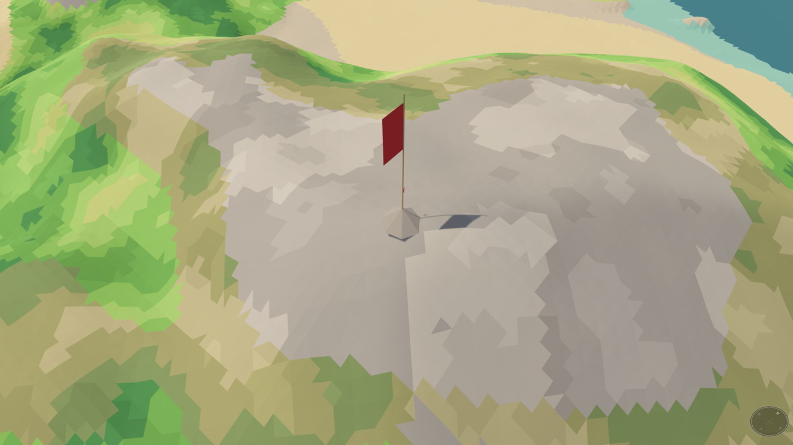

# Genovesa

An experiment in procedural 3D terrain, built with [Bevy](https://bevy.org):
an endless ocean scattered with generated islands. Where it goes is
undecided.


*Sixteen islands of assorted shapes — from single-chunk islets 128 m across
to 1.5 km continents — all drawn to one scale, rendered by `mapgen collage`.*

## Running

```bash
cargo run
```

The first build compiles all of Bevy and takes several minutes. For faster
iteration afterwards:

```bash
cargo run --features dev
```

That build also watches `assets/`, so a model re-exported while the game is
running is picked up without restarting it — which is how models are worked
on here, there being no editor. See [Models](#models).

There is a second binary, `mapgen`, which renders maps from above as PNG
without opening a window — see [Looking at maps](#looking-at-maps).

On macOS it can be wrapped as an application — something with a name and an
icon on it, opened the way anything else is:

```bash
tools/macos-app.sh
```

That writes `target/Genovesa.app`, with the icon drawn into the `.icns` the
system wants and the assets where a bundle keeps them. Its signature is
ad-hoc, which is enough to open it on the machine that built it and no
further: a copy handed to anybody else would need a Developer ID and
notarisation.

## The world, briefly

The world is an infinite plane of ocean with islands scattered across it, and
a seed is a whole world: the layout of the islands and the terrain of every
one of them follow from it deterministically, wherever you sail and in
whatever order you get there. Islands come in all sizes, from lone islets to
continents kilometres across, laid out so that the next island is usually a
short sail away and a big one is an occasional event. Nothing is generated up
front — the ground near the camera streams in as it is approached, and open
ocean between islands costs nothing at all.

Each island is a height field of layered Perlin noise, domain-warped so the
coastlines meander, with one world unit one metre and sea level at zero.
Noise gives the shape, and per-island fitting gives the proportions — how
much land, how much mountain, how tall the peaks — so islands vary in
character without any of them coming out drowned or absurd. Coasts divide
into beaches, rocky shores and cliffs, with the landform and the colours
reading the same field so that a beach is always flat and sandy and a cliff
steep and grey. Where the ground encloses a hollow above the sea it holds a
lake, standing at the height of the lowest saddle on its rim — so the water
sits where water would gather, at the level it would gather to. A lake is
drawn as fresh water rather than as a piece of sea indoors: darker and
stiller, with the grass coming down to a reed margin instead of a beach.

Palms grow along the back of a beach, where the dry sand gives out to
whatever the island is wearing behind it — scattered, and only where a coast
has sand to offer, so a rocky island has none and a long shallow bay is
fringed with them. Behind them, in the shelter of a valley floor or around the
margin of a lake, grow bananas: broader and lower, and wanting the wet ground
a palm has no use for, so the two are found in different places on the same
island.

A day turns in ten minutes. The sun crosses from east to west and the whole
world's colour goes with it: long warm light at either end of the day, a flat
blue middle, and dawn and dusk that are the two ends of the same few seconds
of red without looking alike. Night is lit by a full moon and no more, which
is dark enough that sailing on through it is a bad idea — so a boat lying
still can hold a key to wait for dawn, and the clock runs fast rather than
skipping, so the moon crosses the sky and the light comes back. The hour
belongs to the server, as the weather does: everyone in a world is under the
same sky, and a shared world's night only runs off while all of them are at
anchor waiting it out.

While the sun is up, cloud shadows wander across the water and up the
hillsides. They are the only part of a sky this camera can see — it looks
down, and clouds hung between it and the ground would cover the picture
rather than decorate it — and they go with the wind, so a blow getting up
shows on the ground as shade hurrying over it.

Once it is blowing hard enough the open sea breaks as well, whitecaps going
down the faces of the swell — thicker the harder it blows, and gone by the
time the water is calm.

The shade says the wind is up; a pennant at the masthead says which way it is
going. It streams on the wind the boat itself feels — hanging dead in a calm,
snapping in a blow, blown astern by a boat driving into a light air — so what
the weather is doing can be read without looking away from the water. The
compass in the corner carries an arrow along the wind beside its north, for
when the bearing itself is the question. Under way the two disagree, which is
the difference between a flag and an instrument.

Its rim carries the land within sight as well: an arc for every stretch of
coast near enough to make out, and the brightest of them are the shores not on
the chart yet. This camera looks down rather than out, so an island a few
hundred metres off can be outside the picture altogether — near enough to walk
up the beach of, and nothing on screen to say so. Without the ring the next
landfall is a matter of sailing at random until one turns up. It is an
instrument for sailing and goes dark once the player steps ashore, there being
nothing it could point at from a beach that the island is not already showing.

The look is flat-shaded facets in a small fixed palette — no textures and no
gradients anywhere. The mesh is built in 128 m chunks, drawn coarser than the
height field is sampled, so the facets read as deliberate shapes.

A bigger island means more landscape, not stretched landscape: wavelengths
are fixed in metres, so a large island holds more ranges, more coast and more
inland water rather than larger ones. And a small one only holds what fits —
by the smallest, a low green islet rather than a shrunken alp.

The full story — every constant, and why it is what it is — lives in the
comments in the `world` crate: the terrain without the engine, and without a
renderer to draw it.
[`crates/world/src/terrain.rs`](crates/world/src/terrain.rs) is one island;
[`crates/world/src/archipelago.rs`](crates/world/src/archipelago.rs) is the
ocean of them;
[`crates/world/src/noise.rs`](crates/world/src/noise.rs) is a dependency-free
Perlin implementation, kept in-tree so a seed always produces the same world.
Nothing in the game crate imports any of it — see below.

## The chart

Pressing M lays a chart over the world: an old sea chart, north up and staying
up whichever way the view is turned, with a rose in the corner to say so. It
can be dragged about and zoomed, and it is drawn in ink on flat parchment
rather than on a stained paper texture — there being no textures anywhere else
here to keep one company.

What is on it is only the coast the player has actually closed with — come
near enough to see plainly, by sea or on foot, which is a short band that
follows them as they move. Pass an island down one side and that side is what
the chart has; the other is blank paper until somebody goes round. A coast
that has not been run right around is left open where the survey stopped,
which is how a half-charted island looked before anybody had finished the job
— and the chart knows when the job *is* finished, a coastline only closing
once its whole shore has been followed, which is what claiming and naming an
island hang off.

What is on the sheet is what the world says this player has surveyed. The
server holds which ground each of them has been near enough to look at, works
the lines out of it and sends them; the client records what it is told and
draws it, and has no rule of its own about what counts as seen. It could not
honestly have one, a claim being settled against the coast the server watched
somebody sail. So a chart is the world's memory rather than the machine's, and
it is handed back on returning —
[`crates/game/src/chart.rs`](crates/game/src/chart.rs) is the drawing of it.
The one thing this machine keeps of a world between visits is the token the
player holds it by, which by definition cannot live anywhere else.

An island whose shore has been run right around, and that the player is
standing on, can be *claimed*, and a granted claim leaves a cairn: stones, a
staff and a banner on the headland where the claimant stood, which anybody who
sails past can see. The claim is what earns a name — click an island you hold
and the keyboard becomes the pen, because a chart is written on rather than
filled in — and the name rides with the claim, so what one player reads on the
paper is what everybody reads. That is why what a *survey* is — how ground
becomes a coastline, when a coastline closes, and what makes one an island —
lives in [`crates/protocol/src/survey.rs`](crates/protocol/src/survey.rs)
rather than in the client: a claim can only be settled by a server that works
the coast out the same way, from the same chunks, without taking the
claimant's word for any of it.



*A granted claim, on the scree cap of the island it speaks for. The banner
streams on the true wind, on the same arithmetic a masthead pennant does — so
a player anchored offshore can read the weather off somebody else's claim.*

## Playing together

Every world is a served world. The server generates the ocean and hands it out
a chunk at a time; a client asks for the chunks near its camera and draws what
comes back, and is told nothing else — not the seed, not the layout, not which
chunks are worth asking for. An answer is either open water, which carries no
data at all, or ground, which arrives as corner heights and one palette entry
per triangle — and, on the minority of chunks holding a lake, the level its
water stands at, since that is the one thing about a chunk no client could
work out from the ground it was sent.

That leaves the client small enough to be worth rewriting in another language
against the protocol's documentation alone, which is the point of the
arrangement: it generates nothing, so there is nothing in it that has to
reproduce every noise octave and every rounding to the bit. Determinism still
matters, but only on the server — a seed handed to a different machine to host
has to raise the same islands.

A world started from the menu can be kept to yourself or shared, and both run
a server: the game hosts one and joins it over the loopback exactly as anyone
else joins it over the network, so there is no second, quieter kind of session
for playing alone. Sharing only decides who else can reach it. Others get in
from the menu's join screen, or straight from the command line:

```bash
cargo run -- --join localhost
```

The same world can be hosted without anyone playing on that machine, which is
what a dedicated server is:

```bash
cargo run --bin server -- --seed 7
```

A world opened from the menu is *kept*: leave it and it is still there,
offered again from the menu — the same islands, the clock where it stood, the
player where the world last saw them. Time only passes while a world is open,
so a gale quit out of is a gale returned to, and nothing in a world can be
dodged by leaving it. Returning players are known by a token their own machine
keeps, dealt on first visit; there are no accounts. A dedicated server keeps a
world the same way when given `--world <file>` — and the file *is* the world,
small enough to copy anywhere, raising the same islands on whatever machine
hosts it, which is the seed's promise.

Worlds open in the morning, and a kept world reopens at the hour it closed
on; `--time` opens a new world at any hour instead — or winds a kept one
forward to it — on either binary.

Everyone enters a world for the first time in the same place — afloat just
off the coast of the same island, at the helm of a boat the world provides —
and other players appear in their actual boats, or as coloured markers when
they are ashore on their own feet.

Boats are the world's, not the players': the server tracks every hull, and a
boat is used rather than owned. Step ashore and yours lies at anchor exactly
where you left it — visible to everyone, including while you are away — and
an empty helm belongs to whoever reaches it first, your own included. Leave
a world at a helm and you return to it, provided nobody has sailed it off in
the meantime; harbours slowly collect the boats of players who never came
back, which is the world remembering having been lived in.

The server also owns the sea's creatures worth agreeing on: sharks patrol
the shallows with their fins cutting the surface, dolphin pods and the odd
whale cross the deeper water, and every client is told about the same animal
in the same place — so "look, a whale!" works. Only the birds stay each
client's own invention. The wire is defined
once, in the [`protocol`](crates/protocol/src/lib.rs) crate, which is
the whole of what a client has to understand: the words of a session, the grid
a chunk of ground is drawn on, and the small palette it is painted from.

## Looking at maps

Judging the generator means seeing many islands from above, not walking
around one. The `mapgen` binary renders them in plan straight to PNG, with no
window and no GPU:

```bash
cargo run --release --bin mapgen -- grid
```

| Command | What it draws |
| --- | --- |
| `grid` | nine seeds per island shape — squares, rectangles and the single-chunk islet — all at one scale, a file each; the view a generator change gets judged on |
| `map` | one island on its own, for looking hard at a single seed |
| `collage` | the image at the top of this page |
| `world` | a region of the open world — many islands and the ocean between them; the view a *layout* change gets judged on |

Options: `--size` (metres, `1024` or `1536x1024`), `--seed`, `--scale` in
metres per pixel, and `--out`; for `world`, `--focus` and `--span` say where
and how much. For `grid` and `collage`, which draw many islands at once,
`--seed` is the seed the whole set is spread from. Run `mapgen --help` for
the details.

The collage at the top of this page is redrawn by
[`tools/readme-collage.sh`](tools/readme-collage.sh), which runs `mapgen` and
quantises the result through ffmpeg. It takes the seed, so trying a few and
keeping the one you like is just running it again:

```bash
tools/readme-collage.sh 7
```

## Development helpers

The app takes options too — `--state` to open on a given screen, `--seed` to
pick the world, `--time` to open it at a chosen hour of its day, and
`--focus`, `--zoom` and `--yaw` to say where the player is put down and how
the view opens on them. Run `cargo run -- --help` for the
details. Without `--seed` the run
picks a world of its own and prints which, so a place worth going back to can
be asked for by name.

`--shot` writes a PNG of the view instead of waiting to be looked at. It can be
given as many times as you like: the view options are read left to right, so
each shot is the view as the options before it have left it.

```bash
cargo run -- --seed 7 --focus 98,-317 --yaw 45 \
  --zoom 120 --shot near.png \
  --zoom 340 --shot far.png \
  --yaw 225 --shot behind.png
```

That is one process and one world, so the pictures are all of the same place
and worth comparing against each other. Shots are rendered off screen — no
window opens, and the run quits when the last one is written.

Four `#[ignore]`-d tests measure rather than draw, run like:

```bash
cargo test --release island_shape -- --ignored --nocapture
```

| Test | What it shows |
| --- | --- |
| `island_shape` | per-seed numbers: land and mountain shares, peak height, slopes, coastline |
| `shore_mix` | how each seed's waterline divides between beach, rocky shore and cliff |
| `generator_cost` | the one-off cost of fitting an island's generator — what a server pays the first time anyone approaches an island |
| `arrival_cost` | what one client's arrival costs a server: the chunks within a streaming radius of where a world is entered, split into ground and open water, with the megabytes and the milliseconds |

## Models

Everything the game draws that is not ground is a glTF file under
`assets/models/`, built from a Blender master. What ships is filed by kind —
`models/`, `audio/`, `shaders/`, with the application's icon the one loose file
among them — and `assets-src/` mirrors that, a directory per asset holding what
the shipped file was made from. Those directories carry
the asset's name and not its extension: a name is unique across the tree on its
own, and which format the thing ships as is the build script's business rather
than part of what it is called. One shared `assets-src/models/export.sh` builds
any model, and is where the export settings live. Nothing in `assets-src/`
ships; it is kept so a shape can be taken further.

[`docs/models.md`](docs/models.md) draws all of them on one page — three views
apiece and what each shipped file holds — which is the quickest way to see what
is there. `tools/model-catalog.sh` redraws it.

```bash
assets-src/models/export.sh palm
```

Working on one means Blender open beside a game started with `--features dev`:
export, and the running world has the new shape a moment later. There is no
editor, and this is the substitute — a hull is a thing to be looked at from a
camera forty metres up while it is being moved, not a set of numbers.

A model carries its own colours, one flat tone per facet on its vertices, and
the game draws it with a white matte material that does nothing but let them
through — what a thing is painted is settled in its master, beside its shape.
The files' *materials* are still ignored: glTF materials are PBR, and a hull
lit the way Blender asked would be the one surface in the world with a
highlight on it. What a model *must* carry is checked: `boat.rs` holds the file to
the dimensions the collision code assumes of it, to the order its meshes are
in, and to being flat-shaded and wound outwards — the failures a modelling
program makes easy and the eye lets through.

A model can also *move*. The player's figure is rigged, and its walk is an
action on a dope sheet rather than arithmetic in Rust: the master says what a
running person looks like at any point in the cycle, and the game says where
in that cycle the figure has got to — which it takes from the ground covered
rather than from the clock, so the feet keep up at any speed and a player
backing up runs the cycle backwards. Standing is a second clip, crossfaded
against the run. Rigging anything else works the same way, and the one rule to
keep is that a skin must be rigid — every vertex on exactly one bone — or
facets bend as the model moves and the flat shading goes with them.

Where a model *stands*, when it is scenery rather than the player, is not the
client's business at all. Plants are placed by the server and travel with the
ground a client asks for — so two players anchored off the same beach see the
same trees on it. Each kind has a rule of its own in `world`, pinned by a
digest like the terrain's: palms along the back of whatever beaches a seed
happens to raise, bananas on the valley floors and lake margins behind them.
What a chunk carries of all of them together is gathered in `world`'s `plants`
module, which is where they share the one budget the wire gives a chunk.

## Tests

```bash
cargo test
```

Covers terrain generation invariants, the coast, mesh chunking, the camera
maths and the menu state transitions — both crates, since the workspace runs
them together.

Two things the tests cannot see are worth checking after moving anything
between crates. Bevy must appear nowhere below the game, which is what lets a
server run headless:

```bash
cargo tree --workspace --invert bevy
```

And the game must not depend on the world crate at all — it generates nothing,
and reaches the world only through the server it may be hosting. Its direct
dependencies should be `args`, `bevy`, `protocol` and `server`:

```bash
cargo tree -p game --depth 1
```

## Licence

GPL-3.0 — see [LICENSE](LICENSE).
