# Models

Every master under `assets-src/models/`, drawn from the game's own camera tilt,
from the side, and from below, beside what its shipped `.glb` holds. Generated
by `tools/model-catalog.sh` — re-run it when the models change.

| | from the camera | from the side | from below |
| --- | --- | --- | --- |
| **banana** 4.89 × 4.03 × 4.65 m 392 triangles 1,146 vertices `banana` 43 kB  | 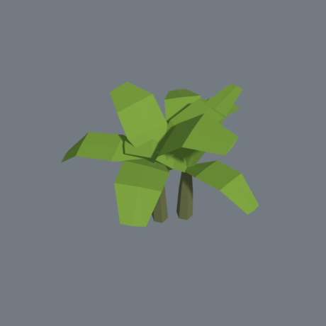 | 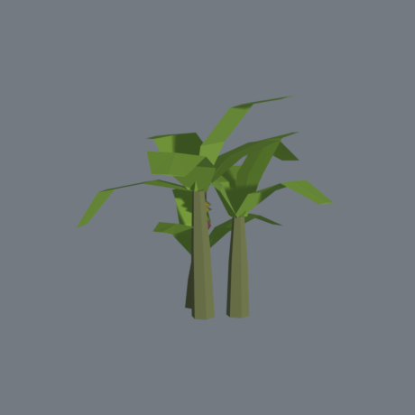 | 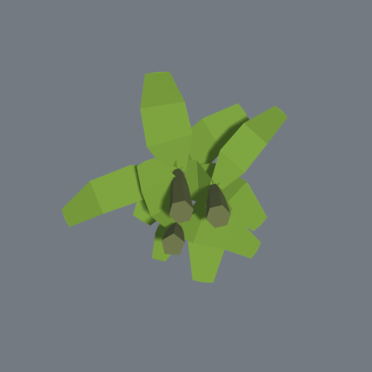 |
| **boat** 2.4 × 7.7 × 7 m 22 triangles 50 vertices `hull`, `spar` 3 kB *painted by the client* | 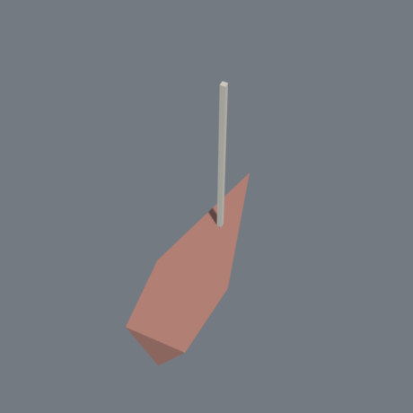 | 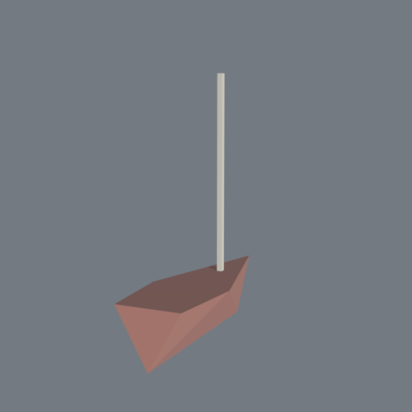 | 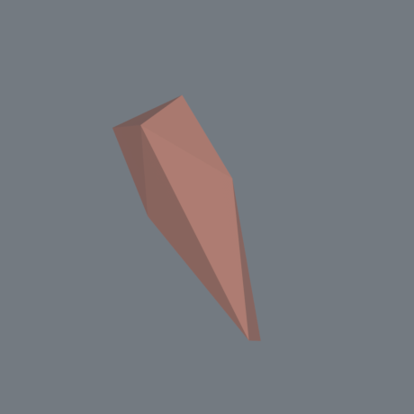 |
| **dolphin** 1.04 × 0.72 × 2.38 m 100 triangles 252 vertices `dolphin` 10 kB  | 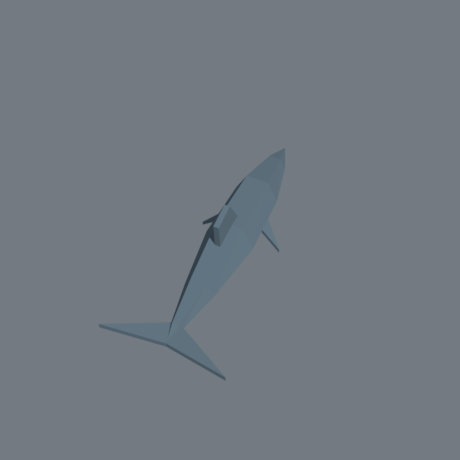 | 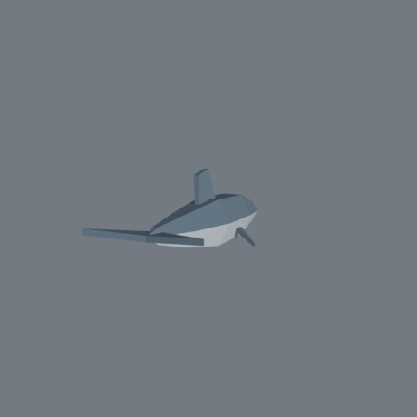 | 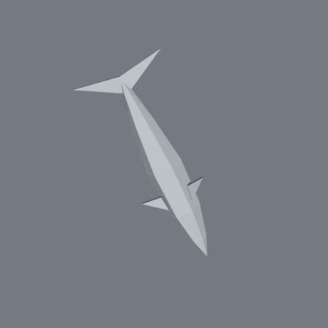 |
| **eagle** 3.7 × 0.56 × 1.7 m 68 triangles 168 vertices `eagle` 7 kB 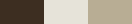 | 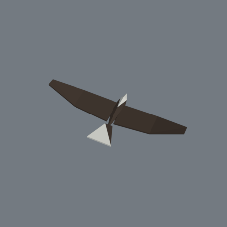 | 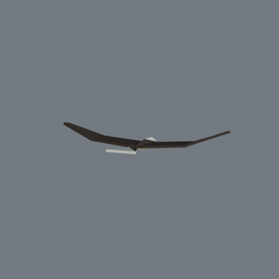 | 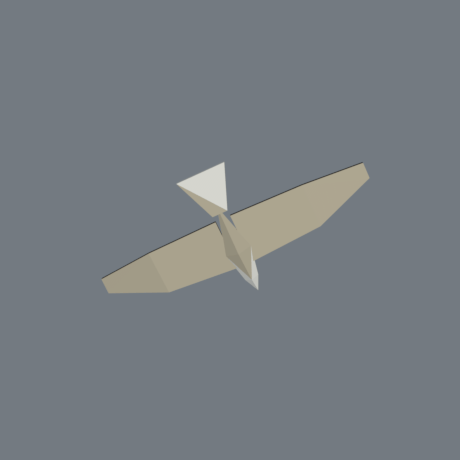 |
| **palm** 5.27 × 6.35 × 4.47 m 92 triangles 228 vertices `palm` 9 kB 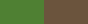 | 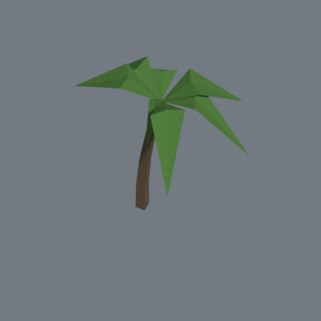 | 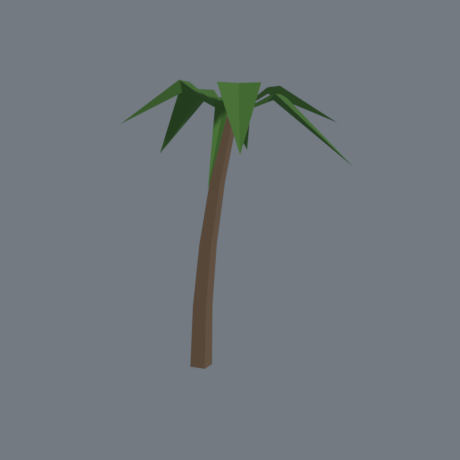 | 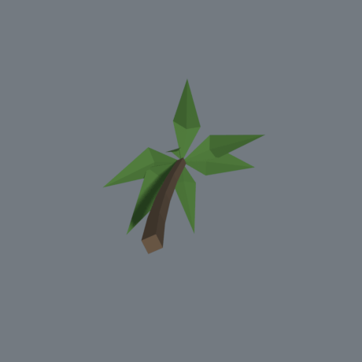 |
| **player** 0.87 × 1.8 × 0.5 m 92 triangles 186 vertices `canvas`, `coat`, `skin` `idle`, `run` 24 kB *painted by the client* | 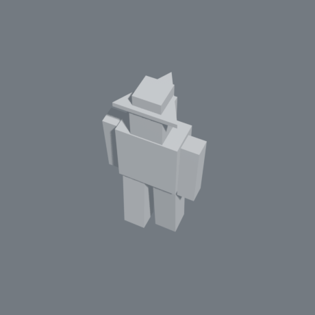 | 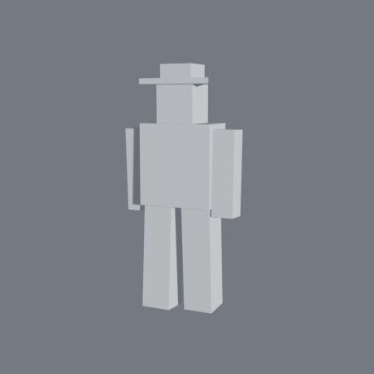 | 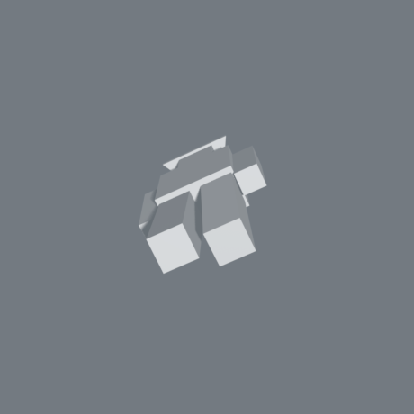 |
| **seabird** 2.1 × 0.17 × 1.02 m 68 triangles 164 vertices `seabird` 7 kB  | 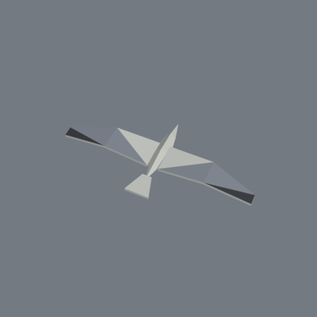 | 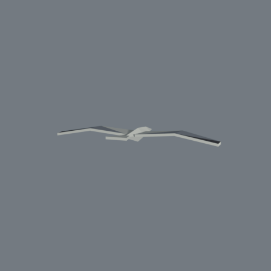 | 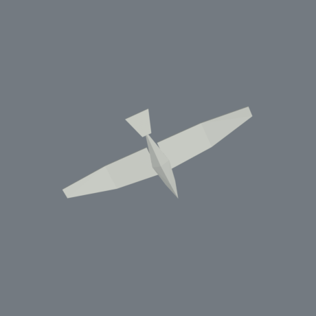 |
| **shark** 1.21 × 0.96 × 2.64 m 120 triangles 240 vertices `hide` `swim` 20 kB  | 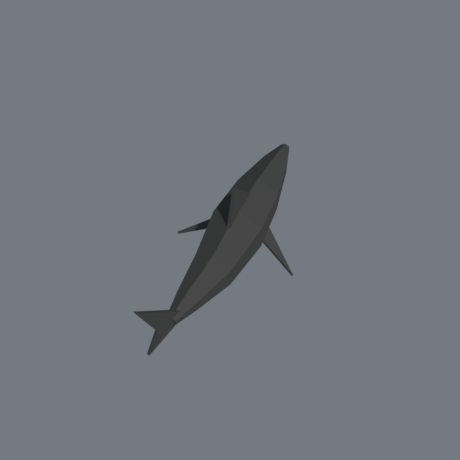 | 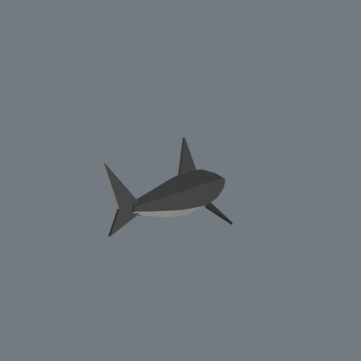 | 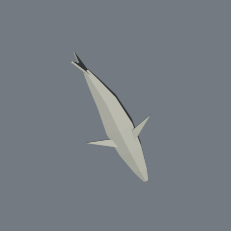 |
| **whale** 4.2 × 2.38 × 11.1 m 100 triangles 252 vertices `whale` 10 kB  | 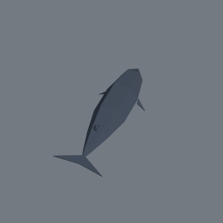 | 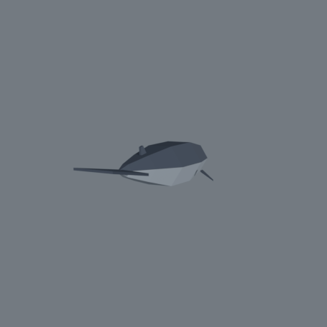 | 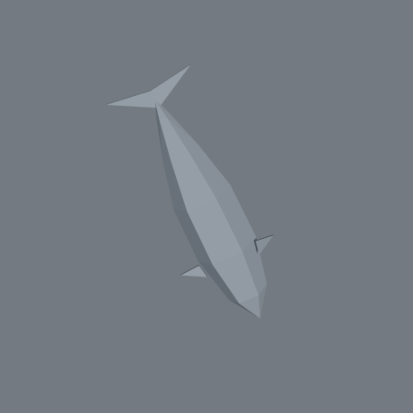 |

